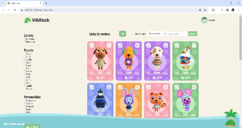
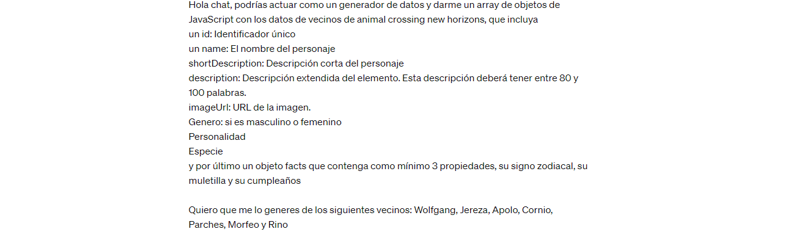
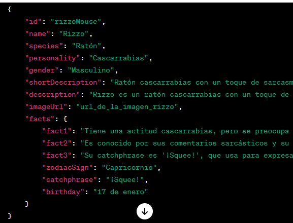
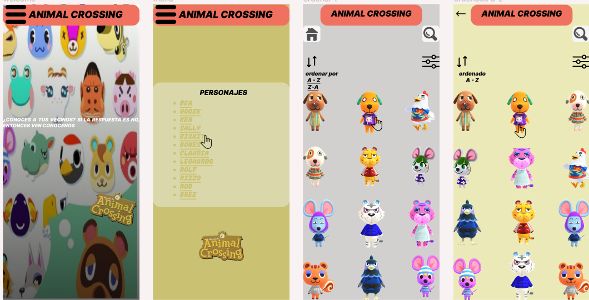
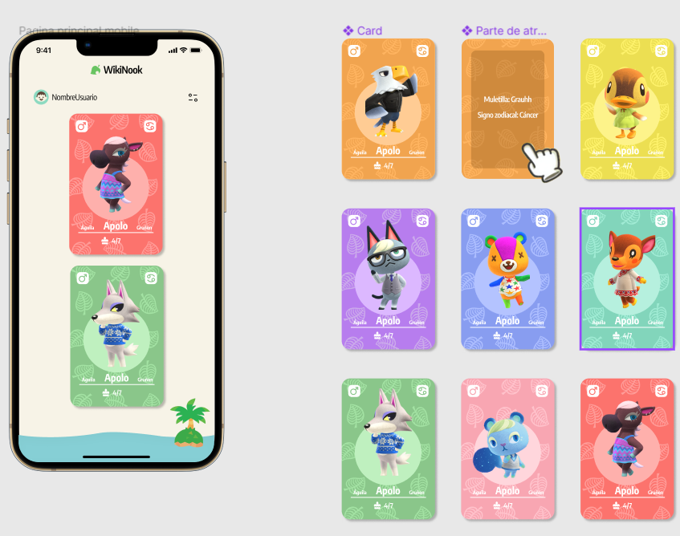

# Dataverse

## Índice

* [1. Introducción](#1-introducción)
* [2. Descripción del proyecto](#2-Descripción-del-proyecto)
* [3. Funcionalidades](#3-funcionalidades)
* [4. Historia de usuario](#4-Historia-de-usuario)
* [5.Tecnologías utilizadas](#5-Tecnologías-utilizadas)
* [6. Diseño y Desarrollo del Prototipo](#6-Diseño-y-Desarrollo-del-Prototipo)

## 1. Introducción
¡Bienvenido a WikiNook 🏡!
Este proyecto es una aplicación web dedicada a los amantes del videojuego Animal Crossing, específicamente diseñada para explorar y conocer más sobre los adorables vecinos del juego. Con un diseño inspirado en la estética de Animal Crossing, WikiNook ofrece una experiencia interactiva para descubrir información detallada sobre cada vecino, clasificándolos según su especie, personalidad y género.

## 2. Descripción del proyecto
WikiNook tiene como objetivo proporcionar a los jugadores de Animal Crossing una plataforma intuitiva y atractiva para explorar información detallada sobre sus vecinos favoritos. Desde clasificar a los vecinos por personalidad y especie hasta la posibilidad de buscarlos por nombre, WikiNook es la guía perfecta para conocer a fondo la comunidad animal de tu isla.

## 3. Funcionalidades

* Exploración por Filtros: Filtra a los vecinos por personalidad, especie y género, esta sección cuenta con un botón de limpiado de dichos filtros y devuelve los datos a su estado inicial.
* Orden Alfabético: Explora la lista de vecinos de manera ascendente o descendente por orden alfabético a través de un selector.
* Barra de Búsqueda: Encuentra rápidamente a tu vecino favorito por su nombre, cuenta con un botón que limpia la búsqueda realizada.
* Estadísticas: Muestra porcentualmente en un modal la cantidad de vecinos del género femenino y del género masculino existentes en la plataforma. 

## 4. Historia de usuario

Se realizo un documento con las funcionalidades del proyecto, pedidas desde el punto de vista de un usuario, simulando una situación en la que podría ser usada. Aquí mostramos el enlace del documento realizada para el usuario que nos permite conocer los pasos en los que se desarrollo el proyecto.
[Enlace del documento](https://docs.google.com/document/d/1K8NoQyA83kZ_FGCIBDcJ6XyT0XXSpx40iVrrJk-1XwY/edit)

## 5. Tecnologías utilizadas
El desarrollo de WikiNook se benefició de un conjunto diverso de tecnologías y herramientas que permitieron una implementación robusta y una experiencia de usuario enriquecedora.

### Prompt utilizado
Se utiliza chatGPT como IA requerida, este nos facilito la extración de información que requeriamos para mostrar la data de las tarjetas.

### HTML
Utilizado para la estructura y marcado del contenido de la aplicación web.

### CSS
Se empleó CSS con la técnica de Flexbox para crear un diseño adaptable (responsive) y atractivo que se alinea con la estética de Animal Crossing.

### JavaScript
JavaScript fue esencial en WikiNook, no solo para la manipulación dinámica del DOM, sino también para implementar diversas funcionalidades clave. Desde la gestión de filtros hasta la interactividad con tarjetas de vecinos y la lógica de búsqueda, JavaScript proporcionó una base sólida para una experiencia de usuario fluida y receptiva. Su versatilidad se extendió más allá de la manipulación del DOM, abarcando diversas interacciones y dinámicas presentes en la aplicación.

### Testing
Se utilizó Jest para realizar pruebas unitarias, asegurando la integridad y funcionalidad correcta de las distintas partes del código. Las pruebas unitarias contribuyeron a mantener la calidad del código y facilitaron futuras actualizaciones y expansiones del proyecto.

## 6. Diseño y Desarrollo del Prototipo
El proceso de diseño y desarrollo del prototipo de WikiNook fue llevado a cabo con atención meticulosa, centrándonos en la experiencia del usuario y la estética inspirada en Animal Crossing. Utilizamos la plataforma de diseño colaborativo Figma para crear prototipos de media y alta fidelidad que sirvieron como guía visual y funcional antes de la implementación final.

### Prototipo fidelidad media 

Se diseñaron dos prototipos uno de media fidelidad que nos muestras las funcionalidades esperamos tuviera el proyecto.

### Prototipo fidelidad alta
Encuanto al prototipo de alta fidelidad es la culminación del proyecto, en cuanto a interacción con el usuario, así como los acabados que debe tener la página y las tarjetas mostradas.

### Implementación
* Transición a Desarrollo.
* Adaptación a Tecnologías Seleccionadas.  
¡Tú también puedes echarle un vistazo a nuestro prototipo! clic aquí [Link al prototipo](https://www.figma.com/proto/lw0HfZvfVOoTsurPPYlpeL/Prototipo%2FDataverse?page-id=0%3A1&type=design&node-id=168-26302&viewport=928%2C-200%2C0.59&t=zLZEgt3rNaGcR8uG-1&scaling=contain&starting-point-node-id=36%3A103&mode=design)

#### Testeos de usabilidad

Se realizo una prueba de usabilidad con usuarios elegidos al azar para ayudarnos a generar información que nos fue de utilidad para el mejoramiento dinámico y visual de la página.

[Enlace del documento](https://docs.google.com/document/d/1moavw2dL9eJssKzZC8Xq0elcS4KpEhgRxF3GcTFZ-sI/edit#heading=h.icq4iwform4o)
  