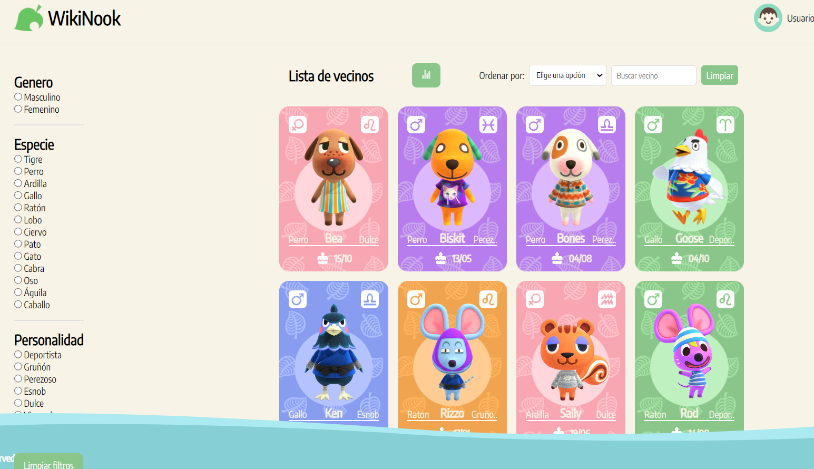
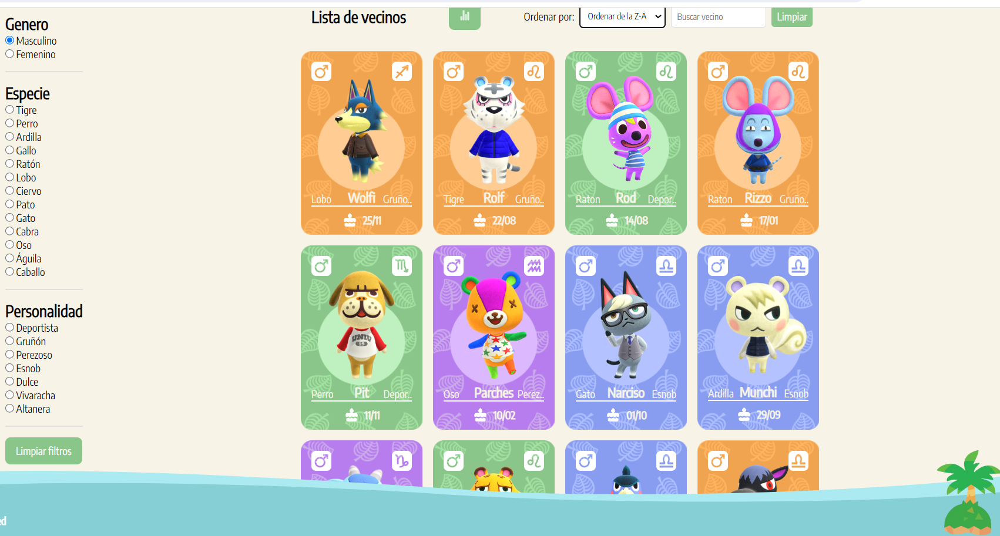
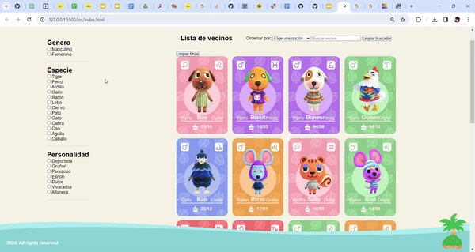

# Dataverse

## Índice

* [1. Introducción](#1-introducción)
* [2. Descripción del proyecto](#2-Descripción-del-proeyecto)
* [3. Funcionalidades](#3-funcionalidades)
* [4. Historia de usuario](#4-Historia-de-usuario)
* [5.Tecnologías utilizadas](#5-Tecnologías-utilizadas)
* [6. Prototipo de alta y media fidelidad](#6-Prototipo-de-alta-y-media-fidelidad)
* [7. Objetivos de aprendizaje](#7-objetivos-de-aprendizaje)

## 1. Introducción
¡Bienvenido a WikiNook 🏡!
Este proyecto es una aplicación web dedicada a los amantes del videojuego Animal Crossing, específicamente diseñada para explorar y conocer más sobre los adorables vecinos del juego. Con un diseño inspirado en la estética de Animal Crossing, WikiNook ofrece una experiencia interactiva para descubrir información detallada sobre cada vecino, clasificándolos según su especie, personalidad y género.

## 2. Descripción del proyecto.
Dataverse es un proyecto para la diversión del público en general, es una página que tiene un estilo adaptable, para laptop, tablet y celular, en el que podras encontrar las tarjetas de tu personaje favorito, pero no solo eso, puedes hacer una búsqueda por nombre de tu personaje favorito, también puedes filtrar las tarjetas por orden, especie, etc.

## 3. Funcionalidades

* Cuenta con una barra de búsqueda y esta contiene un botón de limpiar.
* tiene un espacio que te permite filtrar por especie, personalidad y género.
* Tiene un botón que permite organizar las tarjetas en orden ascendente y descendente.
* Tiene un botón que te permite borrar todos los filtros antes seleccionados.
* Tiene un botón que te permite ver la estadistica encuanto a personajes por su género.

## 4. Historias de ususario

Se realizo un documento con las funcionalidades del proyecto, pedidas desde el punto de vista de un usuario, simulando una situación en la que podría ser usada. 
Aquí mostramos el enlace del documento realizada para el usuario que nos permite conocer los pasos en los que se desarrollo el proyecto.
[Enlace del documento](https://docs.google.com/document/d/1K8NoQyA83kZ_FGCIBDcJ6XyT0XXSpx40iVrrJk-1XwY/edit)

## 5. Tecnologías utilizadas

### Prompt utilizado
Se utiliza chatGPT como IA requerida, este nos facilito la extración de información que requeriamos para mostrar la data de las tarjetas.

### `index.html`

Se uso index como página principal de la estructura del proyecto.

### `src/view.js`

En este archivo se relizaron interacciones con el HTML, creando la estructura de las tarjetas mostradas.

### `main.js, dataFunctions.js`

En el main se realiza el llamado del DOM que nos permite la interacción con los filtros mostrados en la página.
En cuanto al dataFunction es el apartado que se utilizo para realizar las tres funciones que nos permiten realizar la parte dinamica de la página.

### `data.js`

Aquí se puden encontrar los datos generados con ayuda de la IA.

### `dataFunctions.spec.js`

Aquí se realizaron test de prueba unitaria que nos ayudan con el buen funcionamiento de las tres funciones realizadas.

### `test/data.js`

Este archivo no ayuda en la prueba de los test realizados en el archivo dataFunction.spec.js.

## 6. Prototipo de alta y media fidelidad

Se diseñaron dos prototipos uno de media fidelidad que nos muestras las funcionalidades esperamos tuviera el proyecto.

Encuanto al prototipo de alta fidelidad es la culminación del proyecto, en cuanto a interacción con el usuario, así como los acabados quedebe tener la página y las tarjetas mostradas.

#### Testeos de usabilidad

Se realizo una prueba de usabilidad con usarios elegidos al azar para ayudarnos a generar información que nos fue de utilidad para el mejoramiento dinámico y visual de la página.

[Enlace del documento](https://docs.google.com/document/d/1moavw2dL9eJssKzZC8Xq0elcS4KpEhgRxF3GcTFZ-sI/edit#heading=h.icq4iwform4o)
  